# 🤖 AI-Powered Semantic FAQ Desk & Knowledge Retrieval Chatbot

An AI-powered semantic FAQ and knowledge retrieval platform built with **React, Node.js, Express, TensorFlow.js, and Universal Sentence Encoder (USE)**.

Unlike traditional keyword-based chatbots, this system uses **semantic similarity matching** to understand the meaning of user questions and retrieve the most relevant answers from a knowledge base. The platform includes voice input, multi-threaded conversations, authentication, analytics, feedback monitoring, settings customization, and an administrator dashboard for FAQ management and knowledge base training.

---

# 🚀 Key Features

## 🧠 AI Semantic Search Engine

* TensorFlow.js powered NLP engine
* Universal Sentence Encoder (USE) integration
* Semantic question matching using vector embeddings
* Cosine similarity scoring for answer retrieval
* Confidence-based response filtering
* Cached FAQ embeddings for faster performance
* Natural language query matching

---

## 💬 Advanced Chat Management

* Multi-threaded conversations
* Create and switch chat sessions
* Rename chat threads
* Pin important conversations
* Delete conversations
* Automatic chat title generation
* User-specific conversation history
* Persistent chat storage using LocalStorage

---

## 🎙️ Voice Recognition & Smart Input

### Speech-to-Text Integration

* Browser Speech Recognition API
* Real-time voice transcription
* One-click microphone activation
* Automatic speech capture handling

### Smart Input Features

* Auto-expanding textarea
* Smooth scrolling support
* Responsive message composition
* Typing indicators

---

## 💡 Suggested Questions

* Dynamic FAQ recommendations
* Quick-start question prompts
* One-click query submission
* Improved user engagement

---

## 📊 Admin Dashboard & Analytics

### FAQ Management

* Create FAQs
* Edit FAQs
* Delete FAQs
* Search FAQs
* Dynamic category management
* Custom user-defined categories

### Knowledge Base Training

* View unanswered questions
* Convert unresolved queries into FAQs
* Automatic dataset updates
* Knowledge base improvement workflow

### Feedback Monitoring

* Helpful / Not Helpful tracking
* User interaction analytics
* Response quality monitoring
* Feedback insights

### Real-Time Engine Intelligence

* Total query monitoring
* Average confidence tracking
* Active thread statistics
* Top intent/category analysis
* Model accuracy health monitoring
* Real-time performance insights

### Visual Analytics

* Live KPI metric cards
* Confidence score visualization
* Intent distribution analytics
* Chat activity monitoring
* Downloadable conversation history
* Exportable dialogue vault backups

---

## ⚙️ Settings & Customization

### User Preferences

* Dark mode
* Light mode
* Persistent theme preferences
* Settings modal
* Secure logout functionality

### NLP Similarity Trigger

* Adjustable similarity threshold
* Precision tuning between loose and strict matching
* LocalStorage persistence

### Data Portability

* Export chat history as JSON
* Downloadable dialogue vault backups
* Offline conversation storage

### Safety Controls

* Interactive empty-state safety locks
* Disabled actions for unavailable data
* Visual state indicators

---

## 🔐 Authentication & Security

### User Authentication

* User registration
* User login
* Secure session handling
* Local credential management

### Route Protection

* Protected admin routes
* Authentication middleware
* Token validation
* Session persistence

### Data Privacy

* User-specific activity tracking
* Isolated conversation histories
* Secure feedback storage
* Protected telemetry records

---

# 🏗️ Technology Stack

## Frontend

* React 18
* Vite
* HTML5
* CSS3
* Web Speech API
* LocalStorage

## Backend

* Node.js
* Express.js
* JSON Data Storage

## AI & Machine Learning

* TensorFlow.js
* Universal Sentence Encoder (USE)
* Vector Embeddings
* Cosine Similarity Matching

---

# 📂 Project Structure

```text
FAQ-CHATBOT/
├── backend/
│   ├── controllers/
│   │   └── authController.js
│   ├── data/
│   │   ├── faq.json
│   │   ├── feedback.json
│   │   ├── unanswered.json
│   │   └── users.json
│   ├── middleware/
│   │   └── authMiddleware.js
│   ├── node_modules/
│   ├── routes/
│   │   ├── admin.js
│   │   └── chat.js
│   ├── services/
│   │   └── faqService.js
│   ├── utils/
│   │   └── fileHelper.js
│   ├── package-lock.json
│   ├── package.json
│   └── server.js
│
├── frontend/
│   ├── node_modules/
│   ├── src/
│   │   ├── components/
│   │   │   ├── AdminDashboard.jsx
│   │   │   ├── AnalyticsDashboard.jsx
│   │   │   ├── Auth.jsx
│   │   │   ├── ChatWindow.jsx
│   │   │   ├── FeedbackButtons.jsx
│   │   │   ├── Message.jsx
│   │   │   ├── SettingsModal.jsx
│   │   │   ├── Sidebar.jsx
│   │   │   ├── SuggestedQuestions.jsx
│   │   │   ├── ThemeToggle.jsx
│   │   │   └── TypingIndicator.jsx
│   │   ├── hooks/
│   │   │   └── useLocalStorage.js
│   │   ├── services/
│   │   │   └── api.js
│   │   ├── App.css
│   │   ├── App.jsx
│   │   └── main.jsx
│   ├── index.html
│   ├── package-lock.json
│   ├── package.json
│   └── vite.config.js
│
├── screenshots/
│   ├── darkmode/
│   │   ├── analytic_dashboard_0.png
│   │   ├── analytic_dashboard_1.png
│   │   ├── chat_page.png
│   │   ├── dashboard_0.png
│   │   ├── dashboard_1.png
│   │   └── settings_page.png
│   ├── lightmode/
│   │   ├── analytic_dashboard_0.png
│   │   ├── analytic_dashboard_1.png
│   │   ├── chat_page.png
│   │   ├── dashboard_0.png
│   │   ├── dashboard_1.png
│   │   └── settings_page.png
│   ├── login_page.png
│   └── register_page.png
│
├── .gitignore
└── README.md
```

---

# 📸 Application Screenshots

## Authentication

### Login Page

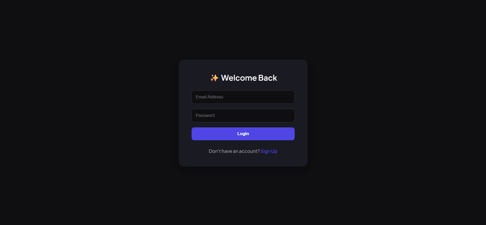

### Register Page

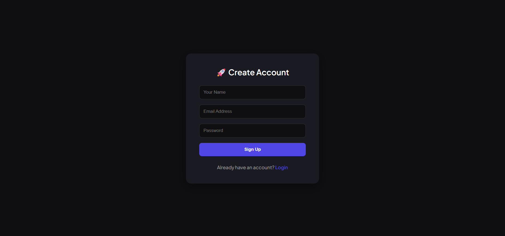

---

## Light Mode

### Chat Interface

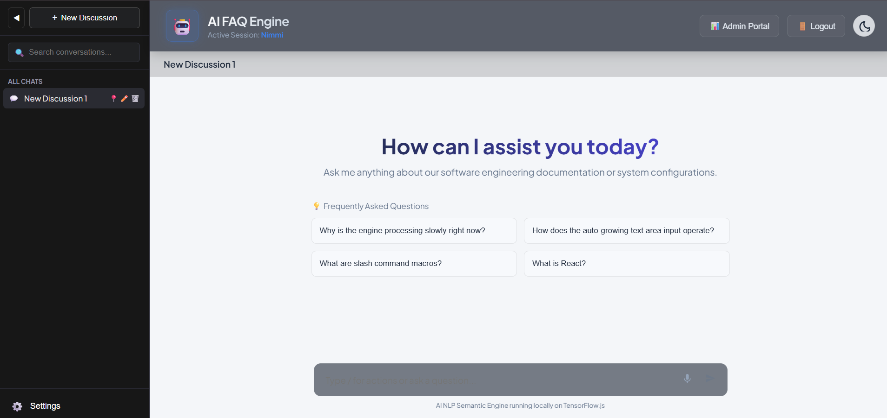

### Admin Dashboard

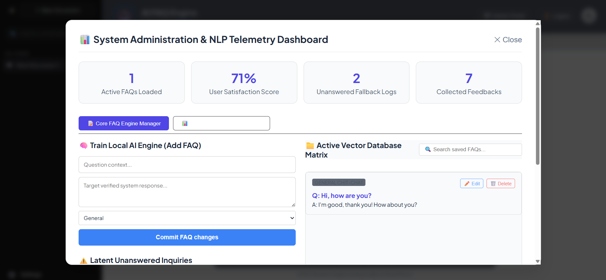

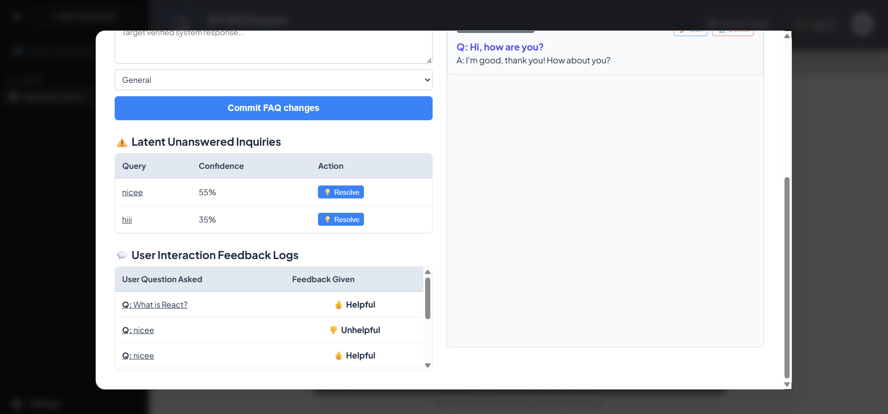

### Analytics Dashboard

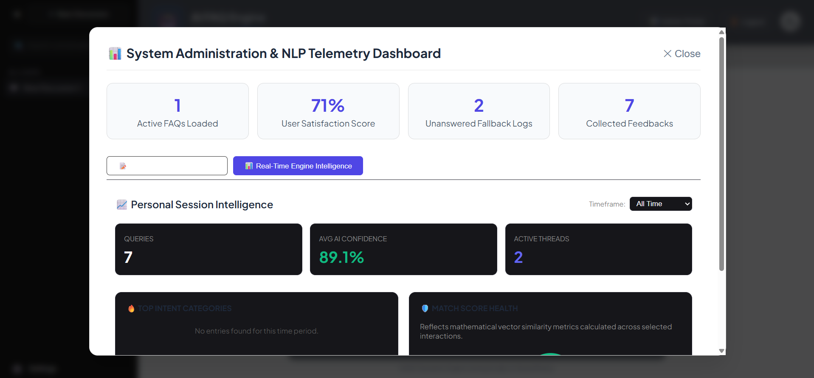

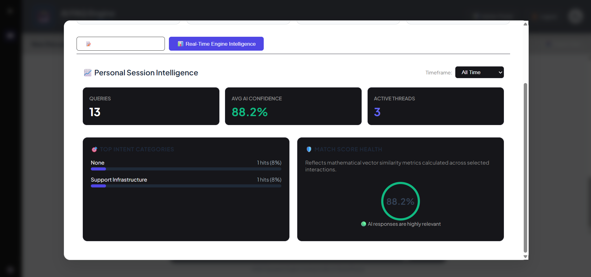

### Settings Page

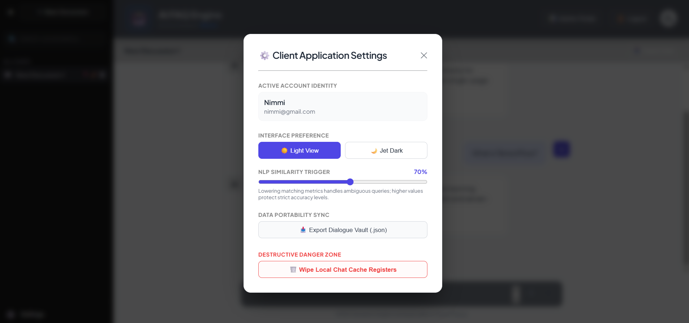

---

## Dark Mode

### Chat Interface

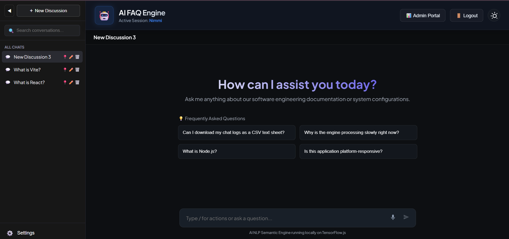

### Admin Dashboard

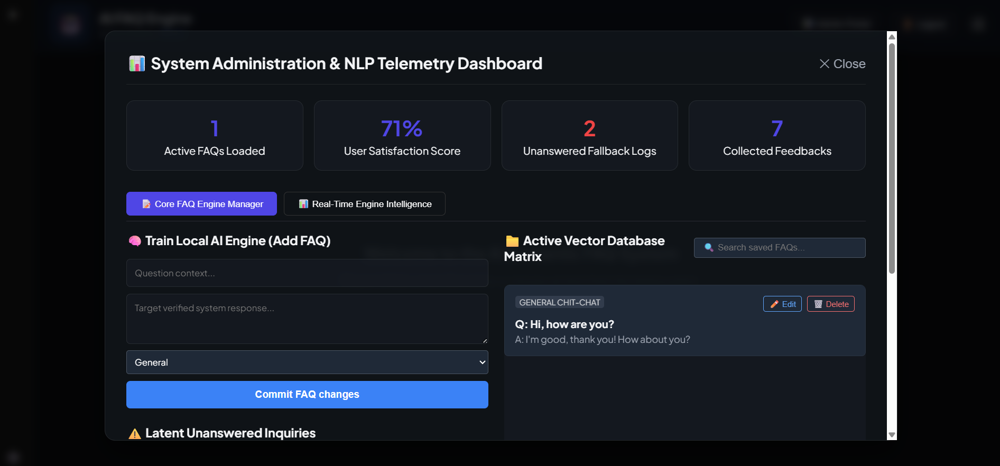

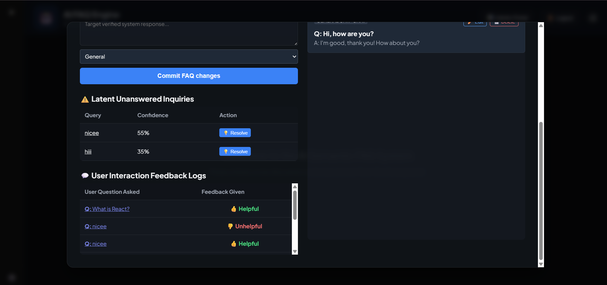

### Analytics Dashboard

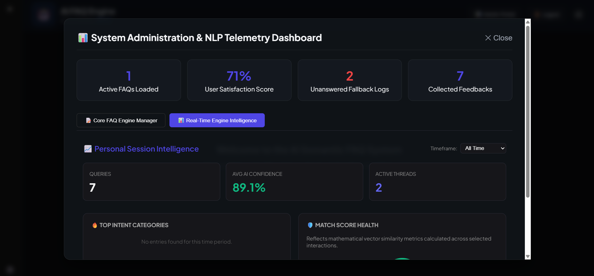

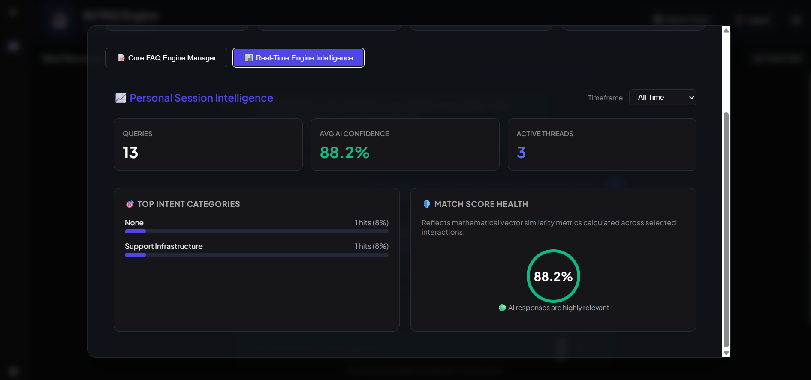

### Settings Page

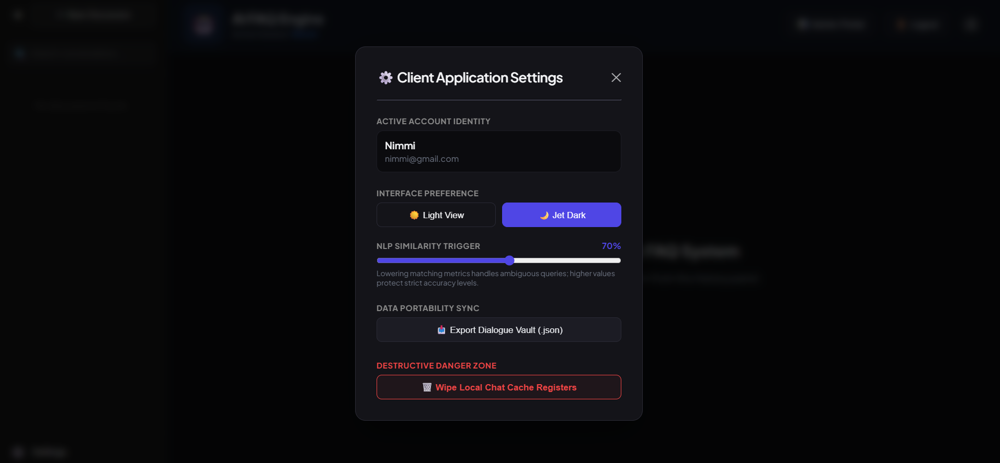

---

# ⚙️ AI Workflow

1. User submits a natural language question.
2. Universal Sentence Encoder generates a dense vector embedding.
3. Pre-computed FAQ embeddings are parsed from memory.
4. Cosine similarity is calculated between incoming and stored vectors.
5. The system filters results against the configured similarity threshold.
6. The highest confidence match is selected.
7. If the score meets the threshold, the verified answer is returned.
8. Otherwise, the query is logged as an unanswered inquiry for administrator review and future training.

---

# ⚙️ Installation

## Install Backend Dependencies

```bash
npm install
```

## Install Frontend Dependencies

```bash
cd frontend
npm install
```

---

# ▶️ Running the Application

## Start Backend Server

```bash
npm run dev
```

## Start Frontend Server

```bash
cd frontend
npm run dev
```

---

# 🌐 Application Access

```text
http://localhost:3000
```

Recommended browsers:

* Google Chrome
* Microsoft Edge

---

# 👩‍💻 Internship Project

Developed as part of a Web Development Internship Program, demonstrating:

* Full-Stack Development
* React Application Development
* REST API Design
* Authentication Systems
* TensorFlow.js Integration
* Semantic Search Implementation
* Speech Recognition
* Dashboard Development
* Responsive UI Design
* CRUD Operations


## ⭐ Highlights

✅ Semantic Search FAQ System
✅ TensorFlow.js & Universal Sentence Encoder Integration
✅ Cosine Similarity Matching
✅ Voice Recognition Support
✅ Multi-Threaded Chat Management
✅ Authentication & Session Management
✅ Admin Dashboard with Analytics
✅ FAQ CRUD Operations
✅ Dynamic Category Management
✅ Custom User-Defined Categories
✅ User Feedback Tracking
✅ Suggested Questions Engine
✅ Dark/Light Theme Support
✅ Adjustable NLP Similarity Trigger
✅ Dialogue Vault Backup Portability
✅ Exportable Chat History
✅ Responsive User Interface
✅ Local JSON Database Storage
✅ Knowledge Base Training Workflow
